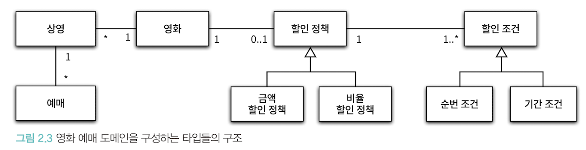

# 02. 객체지향 프로그래밍
## 주요 개념들
### 협력, 객체, 클래스
- 어떤 클래스가 필요한지 고민하기 전에, 어떤 객체들이 필요한지 고민하라.
  - 클래스 : 공통적인 상태와 행동을 공유하는 객체들을 추상화한 것
  - 클래스의 윤곽을 잡기 위해서는, "어떤 객체들이 어떤 상태와 행동을 가지는지를 먼저 결정"해야 한다.
  - 객체를 중심에 두는 접근 방법은 설계를 단순하고 깔끔하게 만든다.

- 객체를 독립적인 존재가 아니라 기능을 구현하기 위해 협력하는 공동체의 일원으로 봐야 한다.
  - 객체는 홀로 존재하는 것이 아니다.
  - 다른 객체에게 도움을 주거나 의존하면서 살아가는 협력적인 존재이다.
  - 객체를 협력하는 공동체의 일원으로 바라보는 것은 설계를 유연하고 확장 가능하게 만든다.

- 객체들의 모양과 윤곽이 잡히면, 공통된 특성과 상태를 가진 객체들을 타입으로 분류하고 이 타입을 기반으로 클래스를 구현하면 된다.

### 도메인

- 도메인(domain)
  - 문제를 해결하기 위해 사용자가 프로그램을 사용하는 분야를 도메인이라고 부른다.
- 객체지향 패러다임은, 요구사항을 분석하는 초기 단계부터 프로그램을 구현하는 마지막 단계까지 "객체"라는 동일한 추상화 기법을 사용한다.
  - 요구사항과 프로그램을 "객체"라는 동일한 관점에서 바라볼 수 있다.
  - 도메인을 구성하는 개념들이 프로그램의 객체와 클래스로 매끄럽게 연결될 수 있다.

> 프로그램의 구조를 이해하고 예상하기 쉽게 만드는 방법
> - 클래스의 이름은 대응되는 도메인 개념의 이름과 동일하거나, 적어도 유사하게 지어라
> - 클래스 사이의 관계 또한 도메인 개념 사이에 맺어진 관계와 유사하게 만들어라.

### 상속과 다형성
- 컴파일 타임 의존성과 런타임 의존성
- 컴파일 타임 : 추상 클래스, 인터페이스에 의존 (코드 수준)
- 런타임 : 추상 클래스, 인터페이스를 구현한 구현체에 의존
- 코드의 의존성과, 실행 시점의 의존성은 서로 다를 수 있다.
  - 다시 말해, 클래스 사이의 의존성과 객체 사이의 의존성은 동일하지 않을 수 있다!
  - 이러한 특징 덕분에 유연하고, 쉽게 재사용 가능하다.
- 코드의 의존성과 실행 시점의 의존성이 다르면 다를 수록 코드를 이해하기 어려워진다.
- 반면에, 다를 수록 코드는 더 유연해지고 확장 가능해진다.
- 적절하게 트레이드 오프를 잘해야 한다..!
- 상속을 이용하면 동일한 인터페이스를 공유하는 클래스들을 하나의 타입 계층으로 묶을 수 있다.
- 구현 상속 (private, protected 등으로 숨긴 요소 (필드, 메서드))
  - 서브 클래싱
  - 순수하게 코드를 재사용하기 위한 목적으로 상속을 사용하는 것을 의미
- 인터페이스 상속 (public method와 같이 공개된 메서드)
  - 서브 타이핑
  - 다형적인 협력을 위해 부모 클래스와 자식 클래스가 인터페이스를 공유할 수 있도록 상속을 이용하는 것
> 상속은 구현 상속이 아니라, 인터페이스 상속을 위해 사용해야 한다!! 
> 인터페이스를 재사용할 목적이 아니라, 구현을 재사용할 목적으로 상속을 사용하면 변경에 취약한 코드를 낳게된다!

### 추상화
- 추상화는 세부적인 내용은 무시한 채, 상위 정책을 쉽고 간단하게 표현할 수 있게 도와준다.
  - 세부사항에 억눌리지 않고, 상위 개념만으로도 도메인의 중요한 개념을 설명할 수 있다.
  - 추상화는 기본적인 애플리케이션의 협력 흐름을 기술한다.
  - 재사용 가능한 설계의 기본인 "디자인 패턴"이나 "프레임워크"도 모두 추상화를 이용해 상위 정책을 정의하는 객체지향 메커니즘을 활용하고 있다.
  - 기존 구조를 수정하지 않고도 새로운 기능을 쉽게 추가하고 확장할 수 있다.
- 설계가 구체적인 상황에 결합되는 것을 방지하여, 유연한 설계가 가능하도록 돕는다.
- 기존 코드를 수정하지 않고도 기능을 확장할 수 있다.

  

### 중요!
- 다른 개발자에 의해 개발된 클래스를 사용할 때 가장 중요한 것은 "클래스의 경계"를 구분짓는 것이다.
  - 클래스는 내부와 외부로 구분된다. 어떤 부분을 외부로 공개할지, 내부로 감출지 결정하라.
  - 경계의 명확성이 객체의 자율성을 보장한다.
- 인터페이스와 구현을 분리하라.
- 설계가 필요한 이유는 변경을 관리하기 위해서이다.
  - 변경을 관리하기 위한 가장 대표적인 기법이 "접근 제어"이다.
- 의미를 좀 더 명시적이고, 분명하게 표현할 수 있다면 "객체"를 사용해서 해당 개념을 구현하라.
  - 개념이 비록 하나의 인스턴스 변수만 포함하도라도, 개념을 명시적으로 표현하는 것은 "전체적인 설계의 명확성과 유연성을 높이는 첫걸음"이다.
- 협력의 관점에서 어떤 객체가 필요한지를 결정하라
  - 그후, 객체들의 공통 상태와 행위를 구현하기 위한 클래스를 작성해라
- 메세지와 메서드를 구분하라.
- 설계는 유연해지면 유연해질수록, 코드를 이해하고 디버깅 하기는 점점 더 어려워진다.
  - 반면, 유연성을 억제하면 코드를 이해하고 디버깅하기는 쉬워지나, 재사용성과 확장 가능성은 낮아진다.
  - 유연성과 가독성 사이에서 고민해야하는데, 적절한 트레이드 오프를 잘 고민해야 한다..!
- 지연 바인딩 / 동적 바인딩 (객체 지향)
  - 메시지와 메서드가 실행 시점에 바인딩하는 것
- 초기 바인딩 / 정적 바인딩
  - 컴파일 시점에 실행될 함수나 프로시저를 결정하는 것
- 예외 케이스를 최소화 하고, 일관성을 유지할 수 있는 방법을 선택하라.
- 작성하는 모든 코드에는 합당한 이유가 있어야 한다.
- 상속은 캡슐화를 위반하며, 설계를 유연하지 못하게 만든다.
  - 상속을 이용하기 위해서는 부모 클래스의 내부 구조를 잘 알고 있어야 한다.
  - 캡슐화의 약화는 자식 클래스가 부모 클래스에 강하게 결합되도록 만들고, 부모 클래스를 변경할 때 자식 클래스도 함께 변경될 확률을 높인다.
  - 부모 클래스와 자식 클래스 사이의 관계를 컴파일 시점에 결정 -> 유연하지 못한 설계!
  - 실행 시점에 객체 종류 변경 불가
- 합성은 상속이 가지는 두가지 문제점을 모두 해결한다.
  - 인터페이스에 정의된 메세지를 통해서만 재사용이 가능하여, 구현을 효과적으로 캡슐화할 수 있다.
  - 외존하는 인스턴스를 교체하는 것이 비교적 쉽기 때문에, 유연한 설계를 낳는다.
  - 상속은 클래스를 통해 강결합 되지만, 합성은 메세지를 통해 느슨하게 결합된다.
  - 따라서, 코드 재사용을 위해서는 상속보다는 합성을 선호하는 것이 더 좋다
- 상속과 합성은 함께 사용해야 한다.
  - 다형성을 위해 인터페이스를 재사용하는 경우에는 상속과 합성을 조합해서 사용해야 한다.