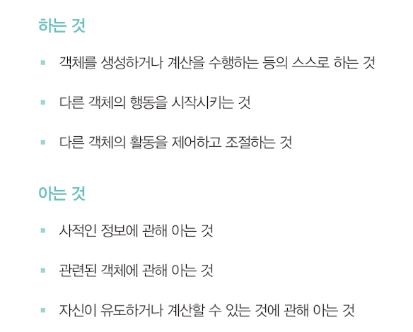

# 역할, 책임, 협력
> - 협력 : 객체들이 애플리케이션의 기능을 구현하기 위해 수행하는 상호작용
> - 책임 : 객체가 협력에 참여하기 위해 수행하는 로직
> - 역할 : 객체들이 협력 안에서 수행하는 책임들이 모인 것
> - 객체 : 상태와 행동을 함께 캡슐화 하는 실행 단위

## 객체 지향 설계의 핵심
- 협력을 구성하기 위해 적절한 객체를 찾고, 적절한 책임을 할당해야 함
- 클래스와 상속은 객체들의 책임과 협력이 어느 정도 자리를 잡은 후에 사용할 수 있는 구현 메커니즘일 뿐
- 역할, 책임, 협력을 중심으로 생각하자.

## 협력
- 하나의 객체가 다른 객체에게 도움을 요청할 때 협력이 시작 됨. (어떤 객체가 다른 객체에게 무엇인가를 요청하는 것)
- 메시지 전송 : 객체 사이의 협력을 위해 사용할 수 있는 유일한 커뮤니케이션 수단
- 객체는 다른 객체의 상세한 내부 구현에 직접 접근할 수 없다. 메시지 전송을 통해서 요청을 전달함.
- 협력이 설계를 위한 문맥을 결정한다.
  - 객체의 존재 이유 : 협력에 참여하고 있기 때문
  - 협력에 참여할 수 있는 이유 : 협력에 필요한 적절한 행동을 보유하고 있기 때문
- 협력이 객체의 행동을 결정하고, 객체를 설계하는 데 필요한 일종의 문맥을 제공한다.

## 책임
- 협력에 참여하기 위해 객체가 수행하는 행동.
- 객체에 의해 정의되는 응집도 있는 행위의 집합. 아래의 내용을 개략적으로 서술한 문장이다.
  - 객체가 유지해야 하는 정보 (무엇을 알고 있는가 - 아는 것)
  - 수행할 수 있는 행동 (무엇을 할 수 있는가 - 하는 것)
  - 
- 협력 안에서 객체에게 할당한 책임이 외부 인터페이스와 내부의 속성을 결정한다.
- 적절한 협력 -> 적절한 책임 -> 적절한 객체에게 할당
- 객체지향 설계에서 가장 중요한 것은 책임이다!

### 책임 할당
- 정보 전문가 패턴 (Information expert)
  - 책임을 수행하는 데 필요한 정보를 가장 잘 알고 있는 전문가에게 책임을 할당하라 
1. 시스템이 사용자에게 제공하는 기능 == 시스템이 담당할 하나의 책임 
2. 시스템 책임을 완료하는 데 필요한 더 작은 책임 찾기 
3. 이를 객체들에게 할당하기 
4. 반복

### 책임 주도 설계
- 책임을 찾고, 책임을 수행할 적절한 객체를 찾아 책임을 할당하는 방식으로 협력을 설계하는 법
1. 시스템이 사용자에게 제공해야 하는 기능인 시스템 책임을 파악한다.
2. 시스템 책임을 더 작은 책임으로 분할한다.
3. 분할된 책임을 수행할 수 있는 적절한 객체/역할을 찾아 책임을 할당한다.
4. 객체가 책임을 수행하는 도중, 다른 객체의 도움이 필요한 경우 이를 책임질 적절한 객체 또는 역할을 찾는다.
5. 해당 객체 또는 역할에게 책임을 할당함으로써 두 객체가 협력하게 한다.

### 메시지가 객체를 결정한다.
- 객체에게 책임을 할당하는 데 필요한 메시지 먼저 식별 -> 메시지를 처리할 객체를 나중에 선택
- 즉, 메시지가 객체를 선택했음.
- 이유
  - 객체가 최소한의 인터페이스를 가질 수 있게 됨
  - 객체가 충분히 추상적인 인터페이스를 가질 수 있게 됨 (무엇을 하는지 표현. 어떻게는 노출 x)
- 충분히 추상적이면서 미니멀리즘을 따르는 인터페이스를 가지게 하고 싶을 때

### 행동이 상태를 결정한다.
- 객체를 객체답게 만드는 것 : 객체가 협력을 위해 다른 객체에게 제공하는 행동!
- 책임이 얼마나 적절한가? -> 협력에 얼마나 적절한가?
- 상태는 단지 객체가 행동을 정상적으로 수행하기 위해 필요한 재료일 뿐! 행동을 결정하고 나서 상태를 결정해라. 행동이 책임이 된다.

## 역할
- 객체가 어떤 특정한 협력 안에서 수행하는 책임의 집합
- 유연하고 재사용 가능한 협력을 얻을 수 있다. 
- 동일한 책임을 수행하는 객체를 역할로 묶는다.
  - 협력 안에서 두 종류의 객체를 교대로 바꿔 끼울 수 있는 일종의 슬롯 == 역할
- 역할은 구체적인 객체를 포괄하는 추상화다.
  - 동일한 책임을 수행하는 역할을 기반으로, 두 개이상의 협력을 하나로 통합할 수 있다.
- 책임과 역할을 중심으로 협력을 바라보라
- 역할을 구현하는 가장 일반적인 방법 : 추상 클래스, 인터페이스 -> 구체 클래스들이 따라야 하는 책임의 집합
  - 추상 클래스 : 책임의 일부를 구현
  - 인터페이스 : 일체의 구현 없이 책임의 집합만을 나열
  - 공통점 : 둘 모두 역할을 정의할 수 있는 구현 방법이다.
  - 다양한 종류의 클래스들을 협력에 참여시킬 수 있는 확장 포인트 제공
- 역할은 다양한 종류의 객체를 수용할 수 있는 일종의 슬롯이자, 구체적인 객체들의 타입을 캡슐화하는 추상화라는 것이 중요하다.
  - 협력 안에서 역할이 어떤 책임을 수행해야 하는지를 결정하는 것이 중요
  - 역할을 구현하는 것은 그 다음 문제.
  - 객체에게 중요한 것은 행동이다.
  - 역할은 객체를 추상화해서 객체 자체가 아닌 협력에 초점을 맞출 수 있게 함
### 객체 대 역할
- 역할은 객체가 참여할 수 있는 일종의 슬롯
- 오직 한 종류의 객체만 협력에 참여하는 상황일 때, 역할이라는 개념을 고려하는 것이 유용할까??
  - 협력에 참여하는 후보가 여러 종류의 객체에 의해 수행될 때 -> 후보가 역할이 됨
  - 단지 한 종류의 객체만이 협력에 참여할 때 -> 후보가 객체가 됨
- 협력 -> 역할 -> 객체 -> 클래스
> 객체에 관해 생각할 때, "이 객체가 무슨 역할을 수행해야 하는가?"라고 자문하라

### 중요한 것은 책임이다
- 설계 초반에는 적절한 책임과 협력의 큰 그림을 탐색하라
  - 협력을 위해 어떤 책임이 필요한지를 먼저 이해해라.
- 역할과 객체를 명확하게 구분하는 것은 초반에는 그리 중요하지 않다.
- 애매하다면 단순히 객체로 싲가하고, 반복적으로 책임과 협력을 정제 해가면서 필요한 순간에 객체로부터 역할을 분리하라

### 역할과 추상화
- 추상화 계층만을 이용할 경우, 중요한 정책을 상위 수준에서 단순화 할 수 있다.
- 설계가 더 유연해진다.