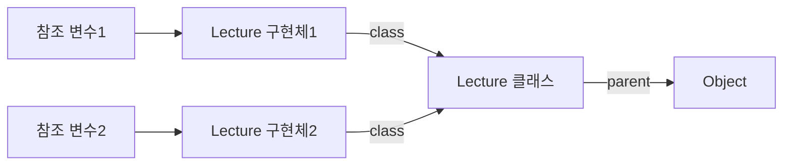

# 다형성 
> 많은 형태를 가질 수 있는 능력

- 여러 타입을 대상으로 동작할 수 있는 코드를 작성할 수 있는 방법 
- 상속의 진정한 목적
  - 코드 재사용이 아닌, 다형성을 위한 서브타입 계층 구축 

## 개념 
- 업캐스팅
- 동적 메서드 탐색
- 동적 바인딩
- self 참조 
- super 참조 

## 데이터 관점에서의 상속
데이터 관점에서의 상속은 자식 클래스의 인스턴스 안에 부모 클래스의 인스턴스를 포함하는 것으로 볼 수있다.

## 행동 관점의 상속 
행동 관점의 상속은 부모 클래스가 정의한 일부 메서드를 자식 클래스의 메서드로 포함시키는 것을 의미한다.
### 어떻게 가능할까?
- 런타임에 시스템이 자식 클래스에 정의되지 않은 메서드가 있을 경우, 이 메서드를 부모 클래스 안에서 탐색하기 때문 
- 객체의 경우, 서로 다른 상태를 저장할 수 있도록 각 인스턴스별로 독립적인 메모리를 할당 받아야 함 
- 하지만, 메서드의 경우에는 동일한 클래스의 인스턴스끼리 공유가 가능하기 때문에, 클래스는 한 번만 메모리에 로드하고 각 인스턴스별로 클래스를 가리키는 포인터를 갖게 하는 것이 경제적임 

### 인스턴스 생성 후의 메모리 상태 

- 인스턴스는 두개가 생성됐지만, 클래스는 단 하나만 메모리에 로드됐다.
- 각 객체는 클래스의 위치를 가리키는 class라는 이름의 포인터를 가지며, 이 포인터를 이용해 자신의 클래스 정보에 접근할 수 있다.
- 클래스는 자신의 부모 클래스인 Object의 위치를 가리키는 `parent`라는 이름의 포인터를 가진다.
  - 해당 포인터를 이용하면 클래스의 상속 계층을 따라 부모 클래스의 정의로 이동하는 것이 가능하다.

### 자식 클래스의 인스턴스를 통해, 어떻게 부모 클래스에 정의된 메서드를 실행할 수 있을까?
1. 메시지를 수신한 객체는 `class`포인터로 연결된 자신의 클래스에서 적절한 메서드가 존재하는지 찾는다.
2. 만약 메서드가 존재하지 않는다면, 클래스의 `parent`포인터를 따라 부모 클래스를 차례대로 훑어가면서 적절한 메서드가 있는지를 검색한다.
3. 자식 클래스에서 부모 클래스로의 메서드 탐색이 가능하기 떄문에, 자식 클래스는 마치 부모 클래스에 구현된 메서드의 복사본을 가지고 있는 것 처럼 보이게 된다.
4. 따라서, 각 객체에 포함된 `class`포인터와 클래스에 포함된 `parent` 포인터를 조합하면, 현재 인스턴스의 클래스에서 최상위 부모 클래스에 이르기까지 모든 부모 클래스에 접근하는 것이 가능하다.

### 자식 클래스의 인스턴스를 생성한 경우 메모리 상태 

## 업캐스팅과 동적 바인딩