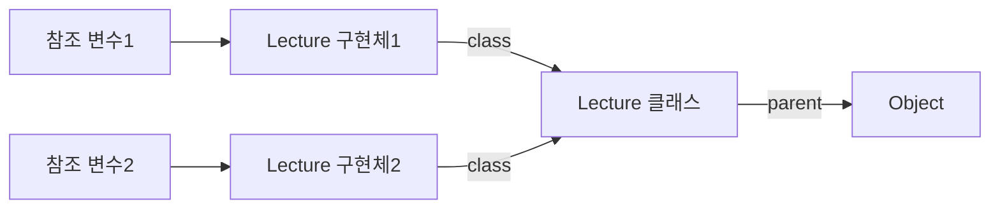

# 다형성 
> 많은 형태를 가질 수 있는 능력

- 여러 타입을 대상으로 동작할 수 있는 코드를 작성할 수 있는 방법 
- 상속의 진정한 목적
  - 코드 재사용이 아닌, 다형성을 위한 서브타입 계층 구축 

## 개념 
- 업캐스팅
- 동적 메서드 탐색
- 동적 바인딩
- self 참조 
- super 참조 


## 데이터 관점에서의 상속
데이터 관점에서의 상속은 자식 클래스의 인스턴스 안에 부모 클래스의 인스턴스를 포함하는 것으로 볼 수있다.


## 행동 관점의 상속 
행동 관점의 상속은 부모 클래스가 정의한 일부 메서드를 자식 클래스의 메서드로 포함시키는 것을 의미한다.
### 어떻게 가능할까?
- 런타임에 시스템이 자식 클래스에 정의되지 않은 메서드가 있을 경우, 이 메서드를 부모 클래스 안에서 탐색하기 때문 
- 객체의 경우, 서로 다른 상태를 저장할 수 있도록 각 인스턴스별로 독립적인 메모리를 할당 받아야 함 
- 하지만, 메서드의 경우에는 동일한 클래스의 인스턴스끼리 공유가 가능하기 때문에, 클래스는 한 번만 메모리에 로드하고 각 인스턴스별로 클래스를 가리키는 포인터를 갖게 하는 것이 경제적임 

### 인스턴스 생성 후의 메모리 상태 

- 인스턴스는 두개가 생성됐지만, 클래스는 단 하나만 메모리에 로드됐다.
- 각 객체는 클래스의 위치를 가리키는 class라는 이름의 포인터를 가지며, 이 포인터를 이용해 자신의 클래스 정보에 접근할 수 있다.
- 클래스는 자신의 부모 클래스인 Object의 위치를 가리키는 `parent`라는 이름의 포인터를 가진다.
  - 해당 포인터를 이용하면 클래스의 상속 계층을 따라 부모 클래스의 정의로 이동하는 것이 가능하다.

### 자식 클래스의 인스턴스를 통해, 어떻게 부모 클래스에 정의된 메서드를 실행할 수 있을까?
1. 메시지를 수신한 객체는 `class`포인터로 연결된 자신의 클래스에서 적절한 메서드가 존재하는지 찾는다.
2. 만약 메서드가 존재하지 않는다면, 클래스의 `parent`포인터를 따라 부모 클래스를 차례대로 훑어가면서 적절한 메서드가 있는지를 검색한다.
3. 자식 클래스에서 부모 클래스로의 메서드 탐색이 가능하기 떄문에, 자식 클래스는 마치 부모 클래스에 구현된 메서드의 복사본을 가지고 있는 것 처럼 보이게 된다.
4. 따라서, 각 객체에 포함된 `class`포인터와 클래스에 포함된 `parent` 포인터를 조합하면, 현재 인스턴스의 클래스에서 최상위 부모 클래스에 이르기까지 모든 부모 클래스에 접근하는 것이 가능하다.


### 자식 클래스의 인스턴스를 생성한 경우 메모리 상태 


## 업캐스팅과 동적 바인딩 
- 업캐스팅 : 부모 클래스 타입으로 선언된 변수에 자식 클래스 인스턴스를 할당하는 것
- 선언된 변수의 타입이 아니라, 메세지를 수신하는 객체의 타입에 따라 실행되는 메서드가 결정된다.
  - 이는 객체지향 시스템이 메시지를 처리할 적절한 메서드를 컴파일 시점이 아니라 **실행 시점**에 결정하기 때문에 가능하다.
  - 이를 **동적 바인딩**이라고 한다.
  - 부모 클래스 타입에 메시지를 전송하더라도, 실행 시에는 실제 클래스를 기반으로 실행될 메서드가 선택된다. 


### 업캐스팅 
- 컴파일러 관점에서 자식 클래스는 아무런 제약 없이 부모 클래스를 대체할 수 있다

### 동적 바인딩
- 컴파일 타임에 호출할 함수를 결정하는 방식
  - 정적 바인딩, 초기 바인딩, 컴파일타임 바인딩
- 실행될 메서드가 런타임에 정해지는 방식 
  - 동적 바인딩, 지연 바인딩 

## 동적 메서드 탐색과 다형성 
객체지향 시스템은 다음 규칙에 따라 실행할 메서드를 선택함 
- 메시지를 수신한 객체는 먼저 자신을 생성한 클래스에 적합한 메서드가 존재하는지 검사함 
  - 존재하면 메서드 실행하고 탐색 종료
- 메서드를 찾지 못했을 경우, 부모 클래스에서 메서드 탐색을 계속함
  - 적합한 메서드를 찾을 때까지 상속 계층을 따라 올라가며 계속 됨
- 상속 계층의 가장 최상위 클래스에 이르렀으나, 메서드를 발견하지 못한 경우 예외를 발생시키며 탐색 중단 

### self 참조
- 객체가 메시지를 수신하면 컴파일러는 self 참조라는 임시 변수를 자동으로 생성한다
- 그 후, 메시지를 수신한 객체를 가리키도록 설정한다 
- 동적 메서드 탐색은 self가 가리키는 객체의 클래스에서 시작해서 상속 계층의 역방향으로 이뤄지며, 탐색이 종료되는 순간 self 참조는 자동 소멸된다.

자바에서의 self 참조는 `this`이다.

### 동적 메서드 탐색의 원리 
1. 자동적인 메시지 위임
   - 자신이 이해할 수 없는 메시지를 전송받은 경우, 상속 계층을 따라 자동으로 이뤄짐 
2. 메서드를 탐색하기 위해 동적인 문맥을 사용함 
   - 메시지를 수신했을 때, 실제로 어떤 메서드를 실행할지를 결정하는 것은 컴파일 시점이 아닌 실행 시점에 이뤄짐 
   - 메서드를 탐색하는 경로는 self 참조를 이용해서 결정함
   - 즉, self 참조가 가리키는 객체의 타입을 변경하면 객체가 실행될 문맥을 동적으로 바꿀 수 있음 

### 자신이 자신에게 다시 메시지를 전송한다면? 
```java
public class Lecture {
    public String stats() {
        return String.format("Title: &s, Evaluation Method: &s", title, getEvaluationMethod());
    }

    public String getEvaluationMethod() {
        return "Pass or Fail";
    }
}
```
- `stats()`호출 -> 현재 객체에게 `getEvaluation`메시지 전송 
  - 즉, 현재 객체에게 메시지를 전송하는 경우 
  - 현재 객체 == self 가 가리키는 객체. == `stats`메시지를 수신한 객체
- `stats`메시지 전송 -> self가 가리키는 객체의 class 파일 확인 -> `stats()`실행
- 그 이후, `this.getEvaluationMethod()`메시지를 self 참조가 가리키는 현재 객체에게 전송 -> self가 가리키는 클래스부터 메서드 탐색 시작 -> `getEvaluationMethod`실행 -> 탐색 종료 


### 하지만 상속이 끼어든다면?
```java
public class GradeLecture extends Lecture {
    @Override
    public String getEvaluationMethod() {
        return "Grade";
    }
}
```
- GradeLecture에 stats 메시지 전송 -> self 참조는 GradeLecture를 가리키도록 설정됨 -> 메서드 탐색이 GradeLecture 클래스부터 시작 
- GradeLecture 클래스에는 stats 메시지를 처리할 수 있는 메서드가 없음 -> 부모 클래스인 Lecture에서 메서드 탐색 -> stats 발견 -> 실행 
- Lecture의 stats를 실행하는 중에, self 참조가 가리키는 객체에게 `getEvaluation`메시지를 전송하라는 구문과 마주침 
- 메서드 탐색은 `self`참조가 가리키는 객체에서 시작 됨 -> GradeLecture 인스턴스임 
- 메시지 탐색은 Lecture가 아닌 GradeLecture에서부터 다시 시작됨
- GradeLecture에서 `getEvaluation`메서드 발견 -> 동적 메서드 탐색 종료 


## 이해할 수 없는 메시지 
### 정적 타입 언어 
- 코드를 컴파일할 때 상속 계층 안의 클래스들이 메시지를 이해할 수 있는지 여부를 판단 
- 상속 계층 전체를 탐색한 후에도 메시지를 처리할 수 있는 메서드를 발견하지 못한다면 컴파일 에러 발생 


### 동적 타입 언어 
- 컴파일 단계가 존재하지 않으므로, 실제로 코드를 실행해보기 전까지 메시지 처리 가능 여부를 판단할 수 없다 
- `doesNotUnderstand`나 `method_missing`에 응답할 수 있는 메서드를 구현할 수도 있다. -> 인터페이스에 정의되지 않은 메시지를 처리할 수 있게 됨 


## self vs super 
- 자식 클래스에서 부모 클래스의 구현을 재사용할 때 사용
  - 하지만, 용도가 부모 클래스에 정의된 메서드를 실행하기 위한 것이 아니다.
  - 정확한 의미는 "지금 해당 클래스의 부모 클래스에서부터 메서드 탐색을 시작하세요"라는 뜻이다.
- `super`는 부모 클래스에서부터 메서드 탐색을 시작하게 함 
- 부모 클래스의 인스턴스에게 메시지를 전송하는 것 처럼 보임 -> `super 전송`
- `self`는 메시지를 수신하는 객체의 클래스에 따라 메서드를 탐색할 시작 위치를 동적으로 결정
  - `self`는 어떤 클래스에서 메시지 탐색이 시작될지 알 수 없다. 
  - 실행 시점에 동적으로 결정
  - 항상 메시지를 수신한 객체를 가리킨다 
- 하지만, `super` 전송은 항상 메시지를 전송하는 클래스의 부모 클래스로부터 시작 됨
  - 항상 해당 클래스의 부모 클래스로부터 메서드 탐색을 시작한다. (미리 정해짐)
  - 컴파일 시점에 미리 결정 


## 상속 대 위임 
- 메서드 탐색 중에는 자식 클래스의 인스턴스와 부모 클래스의 인스턴스가 동일한 self 참조를 공유한다. 
- 위임 : 자신이 수신한 메시지를 다른 객체에게 동일하게 전달해서 처리를 요청하는 것 
  - 위임은 본질적으로 자신이 정의하지 않거나 처리할 수 없는 속성 또는 메서드의 탐색 과정을 다른 객체로 이동시키기 위해 사용함 
  - 항상 현재의 실행 문맥을 가리키는 self 참조를 인자로 전달 
    - 포워딩 : self 참조 전달하지 않음
    - 위임 : self 참조를 전달함 
  - 위임의 정확한 용도
    - 클래스를 이용한 상속 관계를 객체 사이의 합성 관계로 대체해서 다형성을 구현하는 것 
